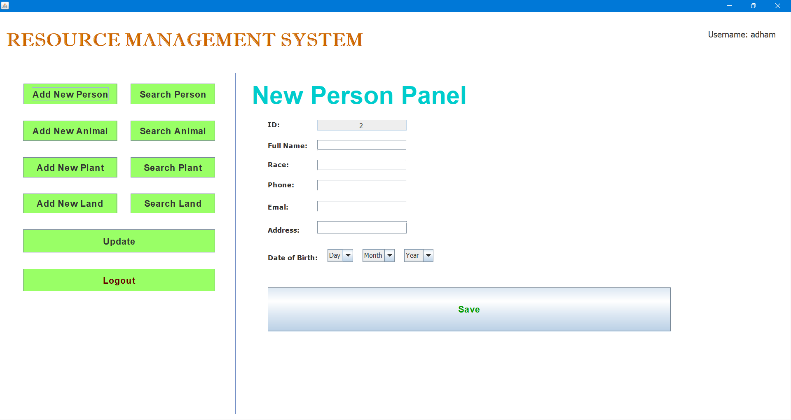

# Resource-Management-System
Human and natural resource management system source code written in java on netbeans ide.

First you should install Xampp software and run the Apache & MySQL services then import the SQL file into created database on phpMyAdmin panel. Now you can import the zip file into netbeans and resolve the mysql_connecter problem if found. Run &  Enjoy...

